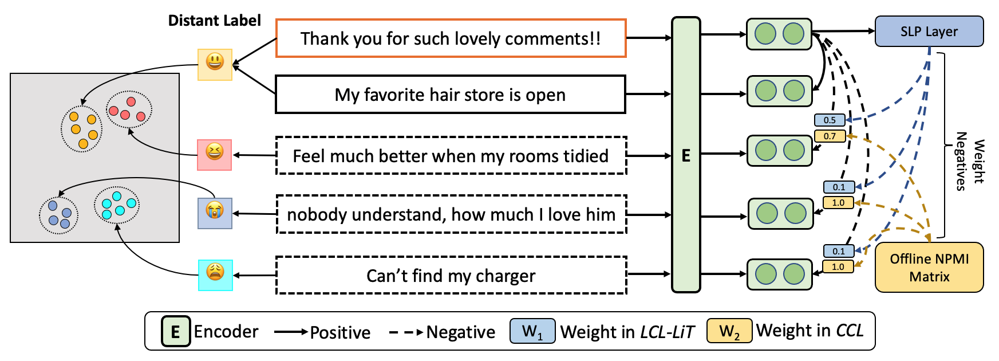
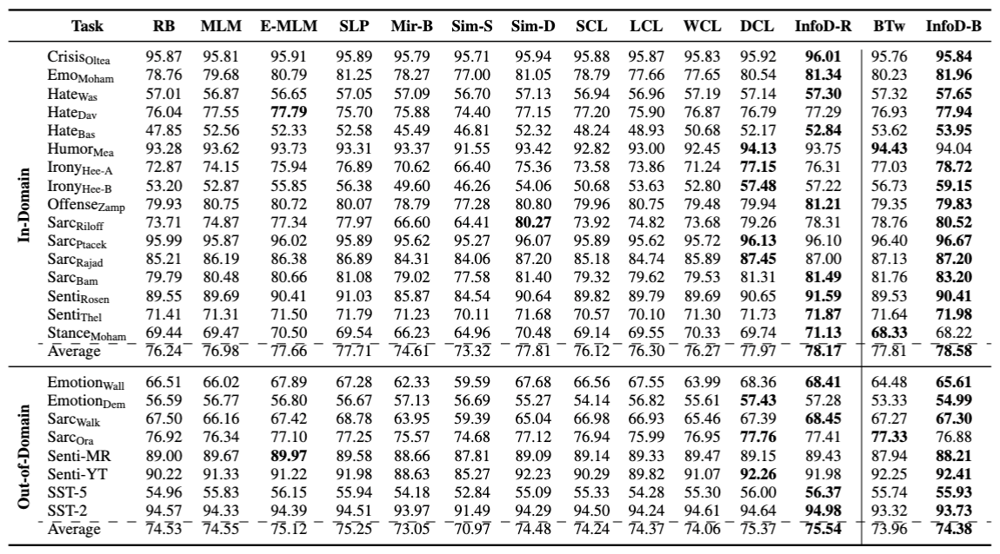

# Contrastive Learning of Sociopragmatic Meaning in Social Media

<p align="center"> <a href="https://chiyuzhang94.github.io/" target="_blank">Chiyu Zhang</a>,  <a href="https://mageed.arts.ubc.ca/" target="_blank">Muhammad Abdul-Mageed</a>, <a href="https://ganeshjawahar.github.io/" target="_blank">Ganesh Jarwaha</a></p>
<p align="center" float="left">
  
<p align="center">Publish at Findings of ACL 2023</p>

[]()
[]()

<p align="center" width="100%">
    <a></a>
</p>
Illustration of our proposed InfoDCL framework. We exploit distant/surrogate labels (i.e., emojis) to supervise two contrastive losses, corpus-aware contrastive loss (CCL) and Light label-aware contrastive loss (LCL-LiT). Sequence representations from our model should keep the cluster of each class distinguishable and preserve semantic relationships between classes.

## Checkpoints of Models Pre-Trained with InfoDCL 
* InfoDCL-RoBERTa trained with TweetEmoji-EN: https://huggingface.co/UBC-NLP/InfoDCL-emoji 
* InfoDCL-RoBERTa trained with TweetEmoji-EN: https://huggingface.co/UBC-NLP/InfoDCL-hashtag

## Model Performance

<p align="center" width="100%">
    <a></a>
</p>
Fine-tuning results on our 24 SM datasets (average macro-F1 over five runs).

## Use of Code
We develop our models based on the scripts of [SimCSE](https://github.com/princeton-nlp/SimCSE/) (*Gao et al.*, 2021).
```
git clone https://github.com/UBC-NLP/infodcl
cd infodcl
python setup.py install
```
### Run pre-training with InfoDCL
[Running shell script](./run_shell.sh)

## Citation
Please cite us if you use our code or models.
```bibtex
@article{zhang-2023-infodcl,
  author       = {
                  Chiyu Zhang and
                  Muhammad Abdul-Mageed and
                  Ganesh Jarwaha
                  },
  title        = {Contrastive Learning of Sociopragmatic Meaning in Social Media},
  booktitle    = {Findings of the Association for Computational Linguistics: {ACL} 2023},
  year         = {2023},
}
```

## Contact Us
If you have any questions related to the code or the paper, feel free to email Chiyu Zhang (chiyuz94@gmail.com). 
